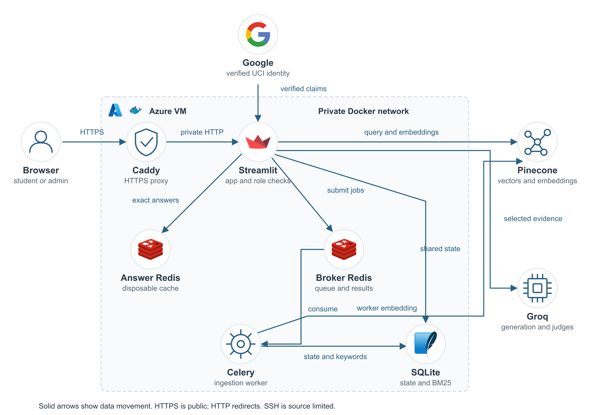

# DocuMind Chemistry

A chemistry document assistant with verified UCI sign-in, a student chat interface,
and an administrator workspace for ingestion, document privacy, retrieval, evaluation
and operations. The interface includes crystal artwork stored locally in the repository.

## Documentation

The [technical guide](docs/TECHNICAL_GUIDE.md) describes the implemented architecture,
ingestion and question workflows, security controls, data retention, configuration,
deployment, recovery and verification. A [PDF edition](docs/reference/DocuMind_Chemistry_Technical_Documentation.pdf)
and [editable diagrams](docs/README.md) are included. Future scaling proposals are
identified separately from current capabilities.



## Features

- Hybrid retrieval: Pinecone dense search + SQLite FTS5/BM25 + reciprocal rank fusion.
- Groq answers with input/output safety checks, evidence citations and shared usage caps.
- PDF, PPT, PPTX, DOCX, MOL2 and CIF ingestion; optional local OCR for scanned PDFs.
- Background Celery ingestion, document versions and reviewed publication controls.
- Redis answer caching with configurable retention; short-lived conversation context.
- Student feedback, audit log pagination/downloads, usage metrics and RAGAS evaluation.
- A fixed 32-case educational retrieval benchmark and encrypted local-state backups.
- Docker Compose stacks for local development and HTTPS cloud deployment.

This repository contains source and synthetic test fixtures. Credentials, original
uploads, Pinecone vectors, private logs, Redis state and backups are not included.

## Local quick start

Install Docker Desktop with Linux containers. Clone the repository and create a private
configuration file **only if one does not already exist**:

```sh
git clone https://github.com/swaroopv4/chemistry-documind.git
cd chemistry-documind
cp .env.example .env
```

On Windows use `Copy-Item .env.example .env` instead of `cp`. Add your own
`GROQ_API_KEY` and `PINECONE_API_KEY` privately, then run:

```sh
docker compose build app
docker compose up --no-build -d
```

Open http://localhost:8501. The local stack permits an explicit owner preview and binds
ports to loopback. It must not be exposed publicly. The stack starts Streamlit, a Linux
Celery worker, durable ingestion Redis and a separate disposable answer cache.

Use `docker compose logs -f worker` to inspect ingestion. Stop with
`docker compose down`; omitting `-v` preserves the queue volume.

## Credentials and verified login

The AI pipeline needs Groq and Pinecone keys; an OpenAI API key is not required.
The OpenAI Python SDK connects to Groq's compatible endpoint. Defaults are
`openai/gpt-oss-20b` and Pinecone `llama-text-embed-v2`, 1024 dimensions, cosine similarity.

Public access additionally requires Google OAuth client ID/secret, a random cookie
secret and an exact administrator email allowlist. Set `ADMIN_EMAILS` to your own
approved UCI administrator account; the example address grants no real account access.
Other accepted verified managed UCI accounts receive student chat.

See [AUTH_SETUP.md](AUTH_SETUP.md) and [AZURE_DEPLOYMENT.md](AZURE_DEPLOYMENT.md).
Never commit `.env`, `.env.cloud`, generated Streamlit secrets, SSH keys or backups.
GitHub stores the code; the Python app runs on a server such as Azure, not GitHub Pages.
No automatic cloud deployment or paid workflow is configured in this repository.

## Document access and pipeline

Upload -> background job -> parsing/OCR -> source-aware chunks -> passage embeddings
-> Pinecone and local keyword index -> private version -> administrator review/publication.

Student question -> identity/rate checks -> safe exact-cache lookup -> input safety check
-> query embedding -> hybrid retrieval of published sources -> cited answer
-> output privacy/citation checks -> cache, feedback and metrics.

New and replacement documents remain private until reviewed and published. Removing a
document removes its vectors through the app's deletion path and invalidates retrieval
state; remote changes are eventually consistent. Inspect chemical symbols and OCR
before publishing. Citations and model judges do not prove scientific correctness.

## Admin workspace

Ask; Job queue; Eval & metrics; RAGAS evaluation; Dashboard; Documents; Logs & Redis;
Readiness. Students receive chat, citations and answer-feedback controls.

Job IDs identify asynchronous ingestion tasks; Redis results expire after one hour.
Version history is separate persistent metadata. Track job recovers a known ID while
its result exists; unknown/expired PENDING is not proof of a running job.

The offline benchmark uses 32 fixed original educational cases, including fictional
measurements. It does not automatically evaluate uploaded documents. RAGAS uses
provider calls and should use reviewed question/reference pairs.

Encrypted state backups include local policies, settings, keyword index, versions,
feedback, budgets and metrics/logs. The separate decryption key, credentials, original
uploads, Redis queues and remote Pinecone vectors are excluded. Finish pending jobs
before backup and retain the decryption key separately.

## Capacity and costs

Defaults allow two concurrent provider calls across app/worker processes, 18 Groq
requests/minute and conservative token/daily budgets. New supported questions normally
use three Groq calls; cached student answers avoid those calls. Questions currently
return a busy/retry response when capacity is exhausted; no student-question queue is
implemented. This single-VM deployment has not been load-tested for thousands of users.

Changing app settings does not increase a provider's allowance or change billing.
Groq, Pinecone and cloud hosting have independent limits and costs. Azure student-credit
protection requires retaining the spending limit and eligible subscription; no automatic
paid upgrade is included. See [READINESS_NOTES.md](READINESS_NOTES.md).

## Testing

Use Python 3.12 and `requirements-tested.txt`, or the Docker environment:

```sh
python -m unittest discover -s tests -p '*validation.py' -v
```

Offline validation uses synthetic fixtures/mocks. Explicit `--live` service checks are
separate and can consume provider quota. Native Windows OCR needs Poppler/Tesseract;
the Docker image includes them. Celery workers should run in Linux containers.

## Project layout and tutorial context

`core/`: access, retrieval, safety, caching, catalog and state.
`ui/`: Streamlit views, styles and artwork.
`phases/`: ingestion/evaluation/metrics modules.
`deploy/`: setup, preflight, credit verification, benchmark and backup utilities.
`tests/` and `benchmarks/`: synthetic validation and educational fixtures.

The project follows this educational series, with additional campus/privacy/operations
features: [Part 1](https://www.youtube.com/watch?v=1UIFg23U8xg),
[Part 2](https://www.youtube.com/watch?v=eYWQS3PHr-0),
[Part 3](https://www.youtube.com/watch?v=CaZQ3uq5SXE),
[Part 4](https://www.youtube.com/watch?v=MZNJggB8-gY).
It is a reconstruction, not an official upstream repository. Historical phase notes
describe intermediate implementations; this README and current code describe the
campus application. See [PIPELINE.md](PIPELINE.md) for details.
