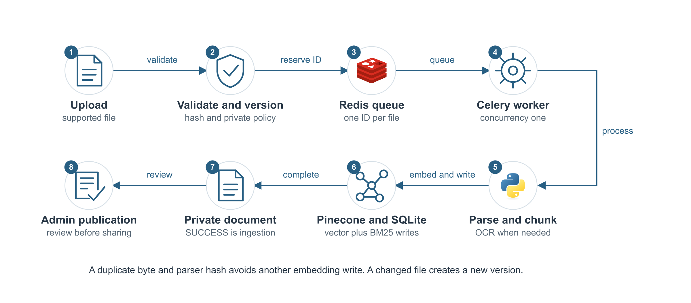
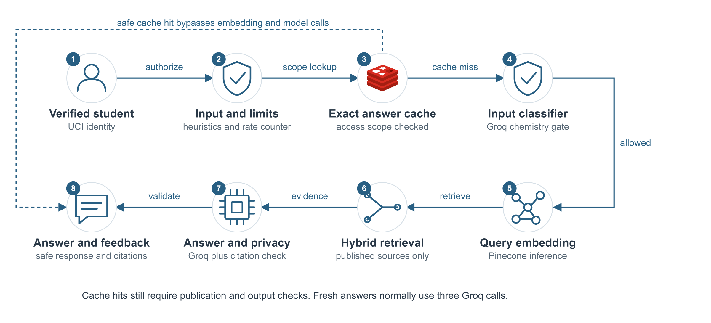
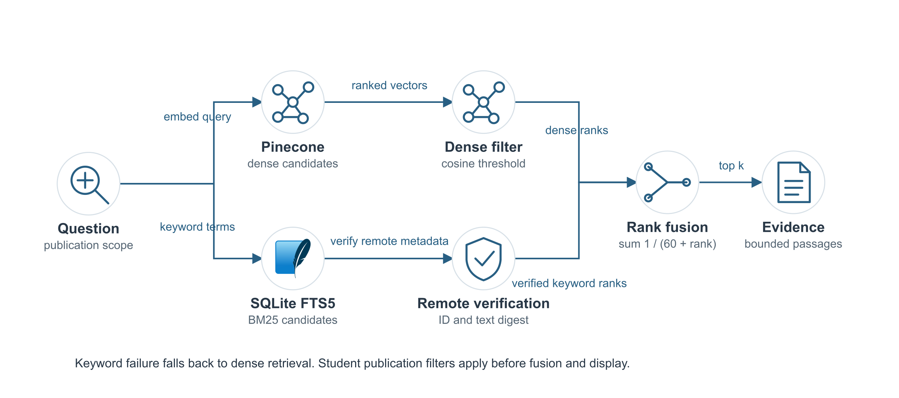

# DocuMind Chemistry Technical Documentation

Version 1.0 | 6 October 2026 | Maintainer Venkat Swaroop Veerla

This document describes the implemented chemistry document assistant and its operational procedures. It is intended for application maintainers, campus administrators and engineers taking responsibility for deployment. The system supports reviewed document publication and verified UCI access on a single server. It has not been validated for thousands of concurrent students.

Source baseline: `f645799d99fa7c36317942def64215f5457d367f`. Repository: https://github.com/swaroopv4/chemistry-documind. Configuration examples contain placeholders; operational credentials and private documents are excluded. Defaults described here can be overridden by persisted administrator settings.

## 1 Project scope

DocuMind retrieves evidence from administrator-managed chemistry documents and generates answers with citations. Students use a dedicated chat interface. Administrators ingest and review files, control publication, inspect retrieval, evaluate answers and operate the service. The application does not calculate molecular properties, simulate experiments or establish the scientific validity of an answer.

| Area | Implemented behavior |
|---|---|
| Identity | Verified Google UCI account and explicit administrator allowlist |
| Retrieval | Pinecone dense search and independent SQLite BM25 combined with rank fusion |
| Generation | Groq GPT OSS 20B with input classification and output privacy checks |
| Documents | PDF, PPT, PPTX, DOCX, MOL2 and CIF with background ingestion |
| Runtime | Streamlit, Celery, two Redis services, SQLite and Caddy in Docker |
| Recovery | Encrypted local-state export with a separate recovery key |

The repository is a reconstruction of an educational project with campus access and operations features added. Historical phase notes describe intermediate versions. Current code and this guide describe the campus implementation. Provider model access, prices and quotas must be checked in the relevant account before a release.

## 2 System architecture


Figure 1 separates the public entry point, the single Azure VM and external identity and AI services. The public browser reaches Caddy over HTTPS. Caddy forwards requests to Streamlit on the Docker network. Google provides identity; the application checks the verified claims before presenting a role-specific interface.

The app and Celery worker share the same local state and staged-upload mounts. Durable Redis carries ingestion messages, job results and rate counters. A separate Redis instance caches answers. Pinecone stores embeddings and chunk metadata remotely. Groq receives selected evidence and safety-check inputs over its API.

This deployment uses one VM. SQLite files are shared between app and worker on that VM; duplicating this stack onto independent servers would create inconsistent policy and budget state. Docker restart policies recover stopped processes after a host restart, but one VM remains a single point of failure.

## 3 Document ingestion workflow



The administrator selects files and submits them. Batch validation accepts 1 to 50 files, each non-empty and at most 20 MiB, with a combined maximum of 250 MiB. Duplicate filenames within a batch are rejected. A successful submission returns a job ID immediately; it does not wait for parsing or embedding to finish.

The application hashes file bytes and parser settings. An existing successful or pending match is not re-embedded. Changed content receives an immutable version name such as `guide__v2.pdf`. A new version makes related catalog entries private while review is pending. Failed or uncertain submissions require inspection before resubmission.

The worker resolves the managed upload, extracts source units, chunks and redacts common personal identifiers, generates passage embeddings, and updates Pinecone plus the local keyword index. Source-aware text chunks default to 400 tokens with 50-token overlap. Chemical record rows remain intact; an oversized indivisible record is rejected. Staged uploads are cleaned after task execution.

| Format | Extracted content and location |
|---|---|
| PDF | Page text; local OCR for scanned pages within the configured page limit |
| PPT and PPTX | Legacy slide text; PPTX also includes tables, groups and speaker notes |
| DOCX | Paragraphs, tables, headers and footers; logical locations rather than page guesses |
| MOL2 and CIF | Validated molecular records or crystallographic blocks with source locations |

SUCCESS means ingestion completed. It does not publish the document. An administrator must inspect text, OCR and personal information, choose a safe student source label, and explicitly publish. Pinecone and SQLite updates are not one distributed transaction; failed writes or external vector changes require reconciliation.

## 4 Student question workflow



The student must have a valid identity. The service checks input length and a per-user rate counter, then applies heuristic input and personal-information checks. It computes a cache scope from the corpus and access/settings revisions and looks for an exact answer in the dedicated answer Redis.

A valid exact-cache hit is returned only after source-publication and output checks. This path avoids new embedding and Groq calls. Cache keys normalize Unicode and whitespace but preserve letter case: `CO` and `Co` must remain different chemistry queries. Redis cache failure falls back to normal retrieval; failure of the rate-counter service closes the question path.

On a cache miss, Groq classifies the question as allowed, off topic, personal or an injection attempt. An allowed question is embedded and searched against published documents. Retrieved passages form a bounded evidence context. Groq generates an answer; citation and output privacy checks run before it is shown or cached.

A normal supported fresh question uses three Groq calls: input classification, answer generation and output privacy review. It also uses a query embedding. Questions with no published evidence or a blocked input can terminate earlier. Student semantic answer reuse is disabled by default; exact reuse remains enabled according to cache settings.

Answers can carry a server-issued feedback ID. Helpful, Incorrect and Incomplete votes belong to that response and the signed-in student. An optional note is limited to 500 characters and redacted before storage. Follow-up context is session-local with a default 600-second expiry; it is cleared when identity or access scope changes.

## 5 Hybrid retrieval design



The dense branch sends the question embedding to Pinecone and retrieves candidates using the document scope. The keyword branch searches SQLite FTS5 with BM25, which favors matching chemical terms, formulas and identifiers. The application applies publication filters independently on both branches before fusion.

Keyword candidates are verified against remote vector metadata before use. A missing vector, changed document identity or mismatched text digest removes that candidate. This prevents a stale local keyword index from returning externally deleted or replaced content. If keyword retrieval or verification fails, the implementation falls back to dense candidates and records a warning.

Candidates are combined using reciprocal rank fusion:

```text
score(chunk) = sum over available branches of 1 / (60 + rank(chunk))
```

The candidate pool is `min(100, max(20, top_k * 4))`; student `top_k` defaults to 5. Dense candidates below the default 0.25 similarity threshold are removed. Fused rank scores and dense cosine scores have different meanings and should not be compared directly.

The context builder uses complete passages within the evidence-token budget. Citations must name a retrieved source and known location, and every answer paragraph must include a valid citation. The application rechecks source access before displaying and caching student answers. Citation membership confirms that a cited location exists in the supplied evidence; it does not prove that the claim follows scientifically from that passage.

## 6 Identity and security controls

Google OAuth uses the openid, email and profile scopes. Streamlit handles the sign-in flow and token/cookie validation. Application authorization additionally checks the issuer, subject, numeric unexpired expiry, verified email, managed domain `uci.edu`, and exact email suffix. An email text field is not an authentication mechanism.

`ADMIN_EMAILS` is an explicit comma-separated allowlist of UCI administrator addresses. Other accepted UCI accounts receive the student role. Roles are checked again on rerun, and identity changes clear session history. An optional Microsoft path requires the actual configured UCI tenant and issuer, an object identifier, an exact UCI username and rejection of guest claims.

| Operation | Student | Administrator |
|---|---|---|
| Ask about published documents | Allowed | Allowed through student preview |
| Inspect raw chunks and private documents | Denied | Allowed |
| Ingest, remove or publish documents | Denied | Allowed |
| View logs, feedback, settings and backups | Denied | Allowed |

New documents are private. The personal-information checkbox records an ingestion audit detail; it does not replace privacy review or make arbitrary personal details safe. Heuristic redaction, input classification, publication rules, output review and cache-source checks provide separate controls. They do not guarantee that every jailbreak or personal detail will be detected.

Production disables the owner preview and refuses missing OAuth credentials or an HTTP callback. HTTPS terminates at Caddy. Cloud Redis ports and the app port remain private; SSH should be restricted to the management IP. Cloud containers use read-only filesystems, dropped capabilities and bounded logs, with writable data mounts and temporary directories. Secrets stay outside the image and repository.

## 7 Data storage and retention

| Data | Location | Retention or recovery behavior |
|---|---|---|
| Embeddings and chunk metadata | Remote Pinecone namespace | Until explicit deletion; excluded from local-state backup |
| Policies, versions and BM25 | `data/state.sqlite3` | Persistent; version-history view returns the newest 1,000 records |
| Provider budgets and settings | `data/state.sqlite3` | Shared across app/worker; usage window is rolling 24 hours |
| Audit events | SQLite audit table | Newest 20,000 entries; UI pages default to 100 records |
| Response and feedback records | SQLite tables | Responses capped at 10,000 and 90 days; orphan feedback removed |
| Metrics | `data/documind.db` | Persistent local telemetry; not a provider invoice |
| Query logs and reports | `data/logs`, `data/reports` | Files included where allowed by the backup manifest |
| Ingestion queue and results | Durable Redis | Queue persistence via AOF; completed results expire after 3,600 seconds |
| Exact answer cache | Separate Redis | Default LRU capacity 100 and TTL 3,600 seconds; disposable |
| Upload staging | `.uploads` | Managed temporary files; cleaned after task execution |
| Recovery key | Private environment or `data/.backup-key` | Must be preserved separately; never included in the archive |

Audit actors use a truncated hash of the identity subject rather than a plain email. This is pseudonymization, not irreversible anonymization. Query and response text can still contain sensitive material despite redaction; administrator exports and backups must be handled as private operational data.

Cache retention is independent of audit retention. LRU, LFU, FIFO, all-with-expiry and disabled modes are configurable. The all-with-expiry mode does not apply the count cap, but TTL and Redis memory eviction still apply. Deleting cached answers does not delete vectors or audit history.

## 8 Administrator procedures

| Workspace | Routine use |
|---|---|
| Ask | Test retrieval and inspect evidence before publication |
| Job queue | Follow ingestion progress, recover a known job ID and refresh statuses |
| Eval and metrics | Inspect local grounding, retrieval, latency and drift indicators |
| RAGAS evaluation | Evaluate reviewed question/reference pairs or supplied answer/context rows |
| Dashboard | Review provider usage, estimated token cost and ingestion activity |
| Documents | Ingest batches, review chunks/OCR, control privacy and inspect versions |
| Logs and Redis | Page/export audit records, inspect cache health and review student feedback |
| Readiness | Check setup, adjust shared limits, run the benchmark and prepare backups |

For ingestion, submit the batch, open Job queue and follow each task. Automatic progress refresh polls while work is active. Refresh jobs reloads visible tracked tasks. Track job adds a pasted ID to the current session's tracked cards; it does not rerun ingestion. Dismiss removes the card from that session, not the stored document.

Use Document version history to find persisted task IDs and ingestion states. Redis PENDING can mean unknown or expired; it is not confirmation that a worker is running. Reconcile a pending version only when the backend confirms FAILURE or REVOKED. Review a successful version and publish it deliberately.

For logs, Previous and Next navigate a stable snapshot of records. Refresh logs starts a new snapshot that includes later entries. Download audit logs exports the requested newest count independently of the displayed page. Cache clearing removes answer reuse; subsequent questions may require retrieval and generation again.

Remove uses the document-deletion path to delete its remote vectors, keyword entries and catalog policy while invalidating corpus/cache state. It is not a rollback of other versions or a purge of historical audit/metrics records. Refresh document statistics after the eventual-consistency delay and confirm the removed source is unavailable to students.

## 9 Configuration reference

Keep real values in ignored `.env` for local development or `.env.cloud` for production. Required secret groups are the Groq/Pinecone keys, OAuth client credentials, cookie secret and cloud Redis passwords. `ADMIN_EMAILS`, hostname, callback and index settings are configuration, not substitutes for credentials. Generate distinct random internal passwords and restrict access to the configuration file.

| Setting | Default | Meaning |
|---|---|---|
| Concurrent provider calls | 2 | Combined active calls across app and worker |
| Groq requests | 18 per minute; 500 per rolling day | Includes safety, answers and evaluation work |
| Groq tokens | 7,000 per minute; 150,000 per rolling day | Reservations are reconciled with reported usage |
| Embedding tokens | 200,000 per rolling day | Shared query and passage embedding budget |
| Provider timeout | 45 seconds | Budget/lease setting; individual call paths also set timeouts |
| Answer and evidence limits | 2,048 and 2,500 tokens | Generation and complete-passage context bounds |
| Student retrieval | Top 5 | Published evidence returned after rank fusion |
| Exact cache | LRU; 100 answers; 3,600 seconds | Separate answer Redis |
| Student semantic cache | Disabled | Optional similarity-based answer reuse |
| Follow-up expiry | 600 seconds | Session-local question context |
| Question length | 4,000 characters | Before provider classification |
| Per-user questions | 20 per minute | Redis counter; configurable environment setting |
| Scanned PDF limit | 20 pages | OCR only when extractable page text is absent |

The default vector index is `documind-groq`, namespace `llama-text-embed-v2-1024`, with 1,024-dimensional cosine embeddings. An incompatible existing index is rejected. Persisted administrator settings override defaults and must remain below the actual provider allowance. These controls do not change provider billing plans or make paid usage free.

## 10 Deployment and release procedure

For local development, create private `.env` from the example only when no configured file exists. Add provider keys and start Docker Desktop with Linux containers. Run from the repository root:

```sh
docker compose build app
docker compose up --no-build -d
```

The local stack binds to loopback and permits owner preview. Public deployment must use `compose.cloud.yaml` and verified identity. Select an eligible Ubuntu x64 VM, configure DNS and restrict SSH. Permit public TCP 80/443 only; do not expose Redis or 8501. Verify Azure subscription state and spending limit before provisioning or changing resources.

On a new server, review the setup script, create private configuration and run:

```sh
sudo bash deploy/azure_vm_setup.sh prepare
# Complete private .env.cloud before starting.
sudo bash deploy/azure_vm_setup.sh start
sudo bash deploy/azure_vm_setup.sh status
```

Before updating an existing service, finish ingestion and take a verified backup plus separate key. Preserve `.env.cloud`, data mounts, uploads and Docker volumes. Record the current image identifier and retain a rollback image. Do not run `prepare` over a configured production environment without reviewing its effects.

Build the candidate image, validate cloud configuration quietly, start the stack and verify HTTPS, container health, real admin/student login, outside-domain rejection, reviewed publication, citations, feedback and cache reuse. Release verification must use controlled chemistry data; do not publish a personal document for testing. No automatic GitHub deployment pipeline is configured.

Rollback restarts the prior validated image against preserved state after checking compatibility. A source-code rollback alone does not undo data or vector changes. Container stop does not deallocate the VM. Azure student-credit exhaustion disables the service when its spending limit remains enabled; Groq and Pinecone accounts have separate billing and quota controls.

## 11 Operations and recovery

Check container health, worker activity, provider budgets, Redis connectivity and available disk space during operation. Docker logs rotate at 10 MiB with three files in the cloud stack. The application dashboard reports local telemetry and estimated provider cost; it does not reconcile Azure invoices or establish scientific answer quality.

| Symptom | First action |
|---|---|
| Busy or rate-limited question | Inspect shared request/token budgets; wait for the reported window |
| No reviewed documents | Check successful ingestion and explicit Published policy |
| PENDING job after a long delay | Look up version metadata, Redis health and worker logs; do not assume failure |
| Poor chemical term retrieval | Inspect chunks/OCR and BM25 index, then compare controlled queries |
| Answer blocked for citations | Inspect supplied passages and locator membership; do not bypass the check |
| Sign-in denied or expired | Sign out/in; verify managed UCI claims and production callback |

Finish pending jobs before encrypted export. The backup contains consistent SQLite snapshots, permitted local logs/reports and a manifest of file sizes/checksums. It excludes credentials, the decryption key, original uploads, Redis queues and remote Pinecone vectors. The encrypted file can appear as one long line in an editor; it is not readable JSON.

```sh
python deploy/backup.py export data/backups/state.fernet
python deploy/backup.py verify data/backups/state.fernet
python deploy/backup.py restore data/backups/state.fernet --destination data/restored-state
```

Use a new archive filename and new restore destination. Preserve the separate key in approved private storage. Before reopening a restored system, stop app/worker, verify database integrity and publication policies, restore private configuration separately, reconcile remote vectors, clear answer caches and rebuild the keyword index as needed. A verified local-state restore is not a full disaster-recovery test of every external service.

## 12 Evaluation and verification

The offline chemistry benchmark contains 32 fixed educational question/passage/reference cases, including explicitly fictional measurements. It runs BM25 ranking without embedding or network calls. Recall at k measures whether relevant material appears in the first k results; mean reciprocal rank measures how early the first relevant result appears. Neither metric measures generated answer accuracy.

```sh
python deploy/benchmark.py --output data/reports/chemistry-offline.json
python deploy/benchmark.py --compare --output data/reports/chemistry-comparison.json
```

The compare command explicitly calls Pinecone embeddings, ranks dense, BM25 and fused candidates locally, and saves a report. Its latency excludes embedding/network time. The fixtures previously achieved recall at 5 and mean reciprocal rank of 1.0; that result does not validate the private campus corpus. Runs are manual, not a scheduled evaluation every few days.

RAGAS evaluates supplied reviewed question/reference pairs or supplied answer/context rows with model judges. It consumes shared provider quota and its scores depend on reference quality and judge behavior. Local grounding and drift metrics are separate heuristics; drift needs adequate fresh-query history. Student feedback reports perceived helpfulness, incorrect content or missing information and requires administrator review.

The public-source validation on 6 October 2026 ran 74 tests covering Azure preflight, identity/roles, readiness, citation/privacy boundaries, log pagination, feedback and asynchronous UI behavior. Seventy-three passed and one Windows OCR test was skipped because local OCR binaries were absent. These results do not constitute a 2,000-user load test or prove every chemistry answer correct.

```sh
python -m unittest discover -s tests -p '*validation.py' -v
```

Run offline tests before release. Explicit `--live` service checks can consume provider quota and must use controlled inputs. Native Windows Celery is not supported for production; use the Linux container. Real student and outside-domain OAuth tests remain a release check even when mocked claim tests pass.

## 13 Capacity and engineering decisions

The two-call setting limits active provider operations, not logged-in students or complete questions. App and worker share that limit. A supported new question normally invokes three Groq calls, so concurrency cannot be translated directly into an exact student count. The application currently returns a busy/retry response; it does not queue student questions automatically.

Increasing concurrency does not raise provider requests-per-minute or tokens-per-minute allowances. Exact repeated questions reduce provider work, but 1,800 distinct questions generally do not benefit from exact caching. Before a campus-scale release, choose an acceptable waiting time, measure whole-path token/latency distributions and test concurrent identities with representative evidence.

| Current decision | Reason and consequence |
|---|---|
| Single VM and shared SQLite | Simple operation and consistent state on one host; no horizontal scaling guarantee |
| Separate broker and cache Redis | Answer eviction must not discard ingestion messages or rate counters |
| Private by default | Ingestion success alone must not authorize student disclosure |
| Student exact cache first | Repeated safe answers avoid new provider calls |
| Student semantic cache disabled | Similar-looking chemical questions can require different answers |
| Layered safety and citations | Multiple checks reduce risk; administrator review remains necessary |

A future deployment for thousands of simultaneous users would require a durable student-question queue, distributed workers, a shared transactional database, distributed budget/access state and a frontend/API designed for multiple replicas. Provider allowances and Pinecone usage must be measured separately. These changes are proposals, not implemented capabilities of this release.

Do not estimate operating cost from student count alone. Cost depends on fresh questions, total input/output tokens including safety and reasoning, context size, retries, cache reuse, server active time and external service plans. Verify current rates at budgeting time; increasing Azure resources consumes student credit faster. No paid upgrade is part of this documentation change.

## 14 Source references and maintenance

| Module | Responsibility |
|---|---|
| `core/access.py`, `core/student.py` | Verified roles and student safety/answer orchestration |
| `core/pipeline.py`, `core/ingestion.py` | Ingestion and document query orchestration |
| `core/retrieval.py`, `core/keyword_index.py` | Independent candidates, verification and rank fusion |
| `core/catalog.py`, `core/versions.py` | Publication, version planning and leases |
| `core/provider_limits.py`, `core/settings.py` | Shared reservations, quotas and runtime settings |
| `core/audit.py`, `core/feedback.py`, `core/backups.py` | Audit retention, feedback ownership and recovery |
| `phases/phase2_async/` | Celery submission, progress and staged-upload cleanup |
| `phases/phase3_hard/`, `phases/phase4_obs/` | Semantic cache, evaluations and local metrics |
| `ui/`, `compose.cloud.yaml`, `deploy/` | Interfaces, container deployment and operations tools |

Module references identify files in the baseline repository commit recorded at the start of this guide. Update this document when identity rules, publication behavior, schema, provider budgets, retention or deployment topology change. Regenerate the diagrams and PDF from the checked-in source so all formats describe the same release.

External operational references:

- Google OpenID Connect: https://developers.google.com/identity/openid-connect/openid-connect
- Streamlit authentication: https://docs.streamlit.io/develop/concepts/connections/authentication
- Celery task results: https://docs.celeryq.dev/en/stable/userguide/configuration.html#result-expires
- Pinecone database limits: https://docs.pinecone.io/reference/api/database-limits/rate-limits
- Groq rate limits: https://console.groq.com/docs/rate-limits
- Azure student-credit behavior: https://learn.microsoft.com/en-us/azure/cost-management-billing/manage/azurestudents-subscription-disabled

The diagram technology logos are pinned Devicon assets with source hashes and license text in `docs/assets/icons`. Groq, Pinecone, Celery, Caddy and logical processes use descriptive service symbols rather than invented brand marks. Logos identify components and do not imply endorsement. SVG files are the editable figure source; PNGs are generated for reliable display in Markdown and PDF.
